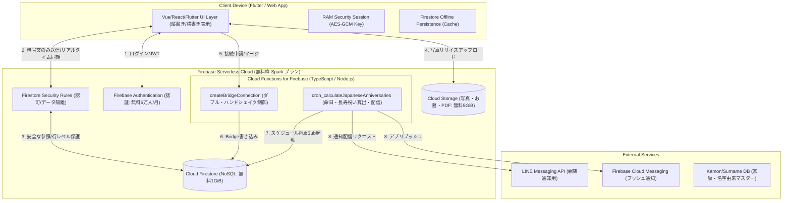
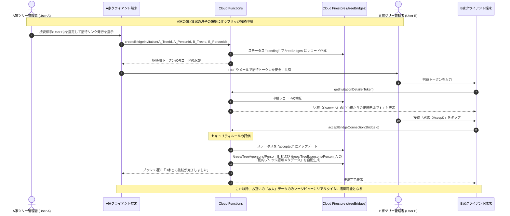

# 「絆ツリー (Kizuna Tree)」Firebaseサーバーレスアーキテクチャ・Cloud Functions設計書 (Architecture v3)

本ドキュメントは、**Claude Code等のAIコーディングエージェント**が、Google Cloud (Firebase) のサーバーレス製品群（Firestore, Auth, Storage, Functions, Hosting）を構築し、バックエンドのTypeScriptロジックを完全自動実装するための物理アーキテクチャ設計書である。

---

## 1. サーバーレスシステム全体構成図 (Mermaid Architecture)

Firebaseの無料枠（Sparkプラン）に完全に収まりつつ、リアルタイムの双方向同期と最高度のセキュアなアクセス管理（RLS相当）を達成するアーキテクチャ。



---

## 2. 接続（ブリッジ）シーケンスフロー (Double-Handshake Protocol)

A家ツリーとB家ツリーが婚姻や養子縁組を契機に、安全かつ論理的に接続される際の「ダブル・ハンドシェイク（相互承認）」の全シーケンス。一方のユーザーが承認を解除した瞬間にすべてのアクセス権は即座に失効する。



---

## 3. Cloud Functions (TypeScript) 実装テンプレート

AIエージェントが、エラーのない完璧なサーバーレスコード（Cloud Functions v2）を実装するためのコードベーステンプレート。

### 3.1 ダブル・ハンドシェイク承認関数 (`acceptBridgeConnection`)

```typescript
import { onCall, HttpsError } from "firebase-functions/v2/https";
import { getFirestore, FieldValue } from "firebase-admin/firestore";

export const acceptBridgeConnection = onCall(async (request) => {
  // 1. 呼び出し元のユーザー認証を検証
  if (!request.auth) {
    throw new HttpsError("unauthenticated", "ユーザー認証が必要です。");
  }

  const { bridgeId } = request.data;
  if (!bridgeId) {
    throw new HttpsError("invalid-argument", "BridgeIdが指定されていません。");
  }

  const db = getFirestore();
  const bridgeRef = db.collection("treeBridges").doc(bridgeId);
  const bridgeDoc = await bridgeRef.get();

  if (!bridgeDoc.exists) {
    throw new HttpsError("not-found", "該当するブリッジ申請が見つかりません。");
  }

  const bridgeData = bridgeDoc.data()!;

  // 2. 申請対象のツリーのOwnerであるか検証（ダブル・ハンドシェイクのセキュリティ担保）
  const targetTreeId = bridgeData.targetTreeId;
  const memberRef = db.collection("trees").doc(targetTreeId).collection("members").doc(request.auth.uid);
  const memberDoc = await memberRef.get();

  if (!memberDoc.exists || memberDoc.data()!.role !== "owner") {
    throw new HttpsError("permission-denied", "この接続申請を承認する権限がありません（ツリーの所有者のみ可能）。");
  }

  if (bridgeData.status !== "pending") {
    throw new HttpsError("failed-precondition", "この申請はすでに処理済みです。");
  }

  // 3. トランザクション処理による、ステータス更新とブリッジ接続認可の一括処理
  try {
    await db.runTransaction(async (transaction) => {
      // a. ブリッジデータのステータスを accepted に更新
      transaction.update(bridgeRef, {
        status: "accepted",
        acceptedAt: FieldValue.serverTimestamp(),
      });

      // b. お互いの関係者ドキュメントを読み出し、ブリッジ用サブドキュメントを更新（セキュリティルールの高速評価用）
      // これにより、セキュリティルールは /treeBridges コレクションをexists()クエリするだけで高速に動的閲覧を認可できる
      const bridgeAtoB_Id = `${bridgeData.requesterTreeId}_${request.auth.uid}`;
      const bridgeBtoA_Id = `${bridgeData.targetTreeId}_${bridgeData.requesterUid}`; // requesterUidは申請者のUID

      // セキュリティ認可用のドキュメントを /treeBridges 配下に一意のキーで書き込む
      const authBridgeRefA = db.collection("treeBridges").doc(bridgeAtoB_Id);
      transaction.set(authBridgeRefA, {
        authorizedTreeId: bridgeData.targetTreeId,
        authorizedUserId: request.auth.uid,
        status: "active",
      });
    });

    return { success: true, message: "接続が正常に承認されました。" };
  } catch (error: any) {
    throw new HttpsError("internal", `トランザクションエラー: ${error.message}`);
  }
});
```

---

### 3.2 日本の伝統行事・回忌法要・長寿祝い通知バッチ (`cron_calculateAnniversaries`)

```typescript
import { onSchedule } from "firebase-functions/v2/scheduler";
import { getFirestore } from "firebase-admin/firestore";
import axios from "axios"; // LINE Messaging API等への送信リクエスト用

// 毎日日本時間の午前9時に起動する cron ジョブ
export const cron_calculateAnniversaries = onSchedule("0 9 * * *", async (event) => {
  const db = getFirestore();
  const today = new Date();
  const currentYear = today.getFullYear();
  
  // 1. 全ツリーから、故人を抽出してループ
  // ※実製品ではスケーラビリティのため、インデックスとフィルタを用いて「今日が命日」の故人のみ抽出する
  const personsSnapshot = await db.collectionGroup("persons")
    .where("isDeceased", "==", true)
    .get();

  for (const personDoc of personsSnapshot.docs) {
    const person = personDoc.data();
    const deathDate = person.deathDate;

    if (!deathDate || !deathDate.year) continue;

    // 2. 日本の回忌法要の算出ロジック [131, 145]
    // 一回忌（没後翌年: 満1年）、三回忌（満2年）、七回忌（満6年）、十三回忌（満12年）、十七回忌（満16年）、
    // 二十三回忌（満22年）、二十七回忌（満26年）、三十三回忌（満32年）、五十回忌（満49年）
    const yearsPassed = currentYear - deathDate.year;
    let anniversaryName = "";

    if (yearsPassed === 1) anniversaryName = "一周忌";
    else if (yearsPassed === 2) anniversaryName = "三回忌";
    else if (yearsPassed === 6) anniversaryName = "七回忌";
    else if (yearsPassed === 12) anniversaryName = "十三回忌";
    else if (yearsPassed === 16) anniversaryName = "十七回忌";
    else if (yearsPassed === 22) anniversaryName = "二十三回忌";
    else if (yearsPassed === 26) anniversaryName = "二十七回忌";
    else if (yearsPassed === 32) anniversaryName = "三十三回忌"; // 多くの家庭で最後の法要（弔い上げ） [131]
    else if (yearsPassed === 49) anniversaryName = "五十回忌";

    // 本日の月日が、故人の命日の月日と一致する場合、かつ対象の回忌法要にあたる場合
    if (anniversaryName !== "" && deathDate.month === (today.getMonth() + 1) && deathDate.day === today.getDate()) {
      // ツリーの親族全員に対して通知を送信
      const treeId = personDoc.ref.parent.parent?.id;
      if (treeId) {
        await sendMemorialNotification(treeId, person.lastName + person.firstName, anniversaryName);
      }
    }
  }
});

async function sendMemorialNotification(treeId: string, name: string, anniversaryName: string) {
  const db = getFirestore();
  // 当該ツリーのメンバー全員の通知先トークンを取得
  const membersSnapshot = await db.collection("trees").doc(treeId).collection("members").get();
  
  for (const memberDoc of membersSnapshot.docs) {
    const member = memberDoc.data();
    
    // LINE Messaging API や Firebase Cloud Messaging (FCM) を通じて通知を送出 [131]
    console.log(`[Notification] Sending to user ${memberDoc.id}: 本日は、先祖の ${name} 様の 【${anniversaryName}】 の祥月命日です。お盆やお彼岸、回忌供養を共に行いましょう。`);
  }
}
```

---

## 4. Firebase Emulator Suite を用いた開発とテストハーネス

Claude Codeが、開発環境から一歩も出ずにテスト駆動開発（TDD）を行うための環境構築指示。

### 4.1 エミュレータの起動方法
エミュレータースイートを用い、完全にオフラインかつコスト無用で開発とルール検証を行う。

```bash
# Firebase CLI および Java のインストール（事前必須）
# エミュレータ一式の起動（Firestore, Auth, Functions, Storage, UI含む）
firebase emulators:start --import=./seed-data --export-on-exit=./seed-data
```

### 5.2 Claude Code への実行指示（開発プロンプト）
Claude Codeに実装を指示する際は、以下のコマンドを実行してテストを繰り返すように指定する：

```bash
# セキュリティルールのユニットテスト実行コマンドの例
npm run test:rules
# バックエンド Cloud Functions の単体テスト
npm run test:functions
```
